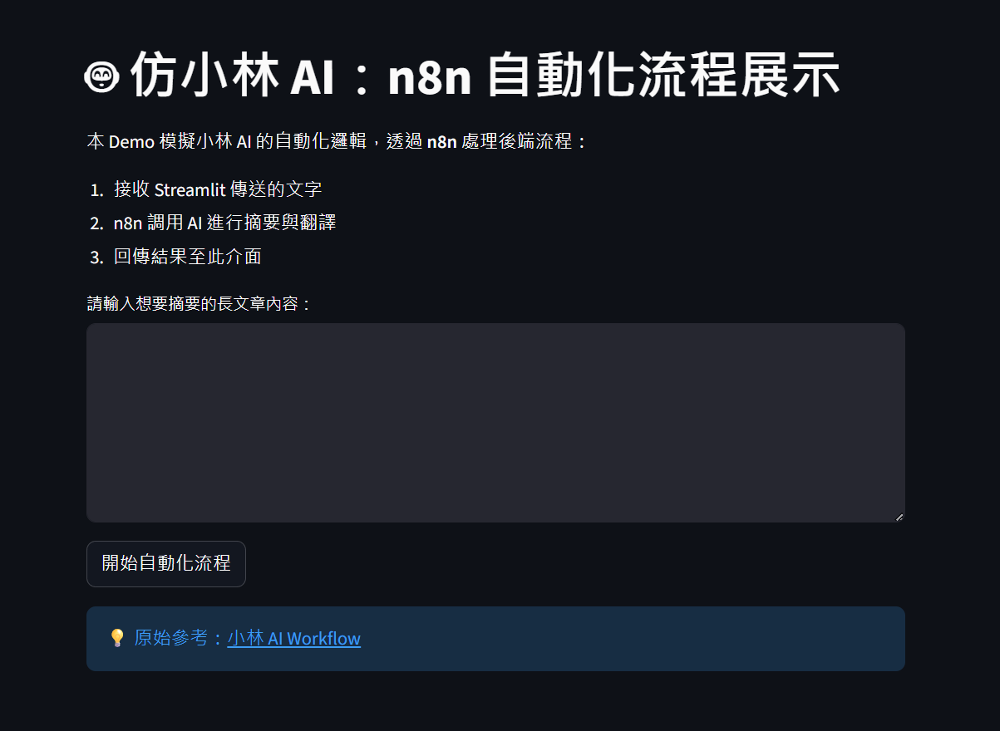

# 🤖 n8n AI 自動化流程：文章摘要與翻譯機器人 (仿小林 AI)

這是一個受 [AI 學長小林](https://github.com/soluckysummer/n8n_workflows) 啟發的自動化專案。透過 **n8n** 作為後端自動化引擎，結合 **OpenAI / Claude** 模型，實現從網頁前端輸入到後端自動處理的完整流程。

## 🌟 功能特點
- **自動化流轉**：利用 Webhook 接收資料，無需人工干預。
- **AI 智能摘要**：自動將長篇文章提煉出核心重點。
- **多語系翻譯**：支援將結果翻譯為繁體中文。
- **Streamlit 介面**：提供友善的互動介面，方便進行 Demo 展示。

---

## 🛠 系統架構
1. **Frontend**: Streamlit (Python)
2. **Automation**: n8n (Workflow)
3. **AI Model**: GPT-4o / Claude 3.5 Sonnet
4. **Integration**: Webhook (JSON POST)

---

## 🚀 快速開始

### 1. 部署 n8n 流程
- 下載本專案中的 `workflow.json`。
- 開啟你的 n8n 畫布，點擊 **Import from File** 並選擇該 JSON 檔案。
- 設定你的 **OpenAI API Key**。
- 點擊右上角 **Execute Workflow** 或開啟 **Active** 模式。
- 複製 **Webhook URL** (例如: `https://.../webhook/ai-demo`)。

### 2. 設定 Streamlit 環境
在本地端執行，請先確保已安裝必要套件：

```bash
pip install streamlit requests
```
3. 執行程式碼
開啟 app.py，將變數 N8N_WEBHOOK_URL 替換為你在 n8n 取得的 URL。

在終端機執行：

```Bash

streamlit run app.py
```
📂 檔案結構說明
app.py: Streamlit 前端 Demo 程式碼。

workflow.json: n8n 自動化流程設定檔。

requirements.txt: 雲端部署所需的套件清單。

README.md: 專案說明文件。

📺 Demo 展示


n8n 流程圖
🔗 參考資料
小林 AI 原始專案

小林 AI 影片教學

📝 授權聲明
本專案僅供學習與學術交流使用。